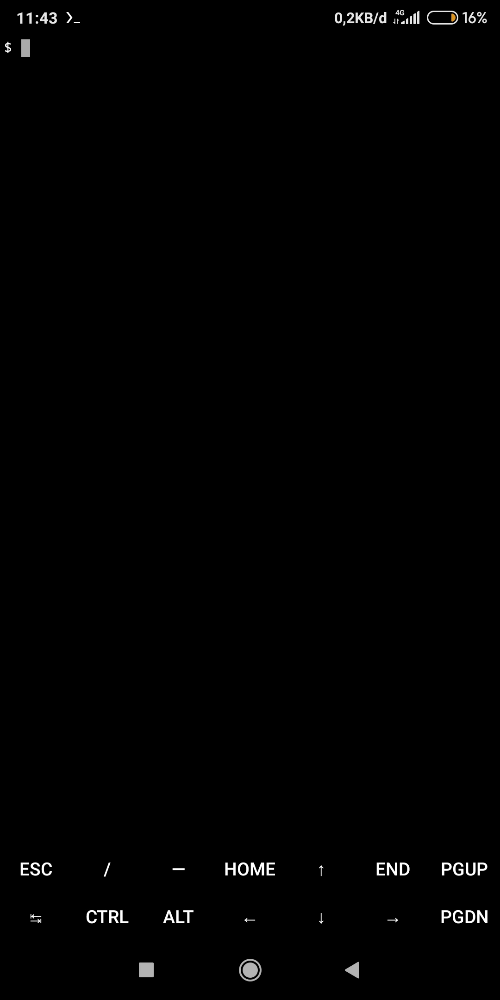

# termux-addkeys

Tombol tambahan untuk termux

# Cara instalasi
	$ apt install git
	$ git clone https://github.com/apolbox/termux-addkeys.git
	$ cd termux-addkeys
	$ chmod +x ./install.sh
	$ ./install.sh

Selesai.